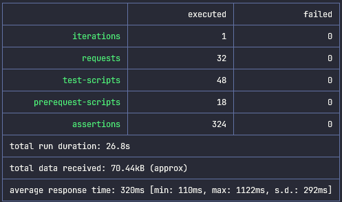

# RealWorld

An application written in Rust that adheres to the [RealWorld](https://github.com/gothinkster/realworld) specification. For
more information on the specification head over to the [RealWorld](https://github.com/gothinkster/realworld) repo.

## Stack

* Language - [Rust](https://www.rust-lang.org/)
* HTTP - [axum](https://docs.rs/axum/latest/axum/)
* Database - [PostgreSQL](https://www.postgresql.org/)

A `docker-compose.yml` file is provided so that all dependencies of the application can be run locally which requires
[Docker](https://www.docker.com/) to be installed.

## Getting Started

``` sh
# set the password to use for the db
> export RW_DATABASE_PASSWORD=<password>

# set the signing key used to sign and validate auth tokens
> export RW_SIGNING_KEY=<signing-key>

# start the infrastructure required to run the application
> docker-compose up -d

# run the application
> cargo run
```

## Running API Tests

A script to run tests using a Postman collection is provided in the `api-tests` folder. Assuming the application is
already running, the following commands can be executed to run the API tests.

```sh
# change to the dir with the script and supporting files
> cd api-tests

# run the tests specifying the host and port of your application
> API_URL=http://localhost:7100/api ./run-api-tests.sh
```

> Note that the script requires [npx](https://github.com/npm/npx) to be installed.

After the tests run, output similar to the following image should be visible in the console.


